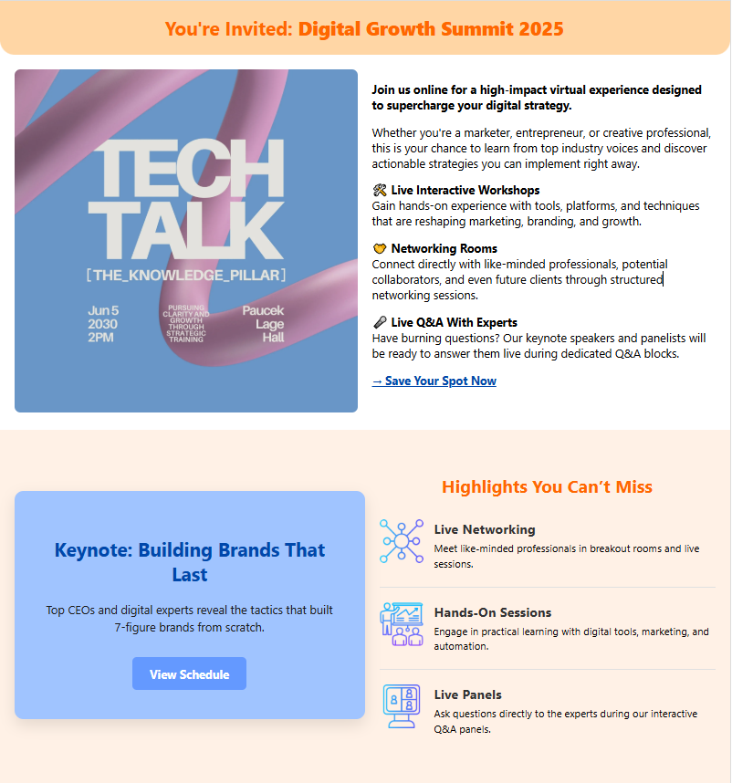

## ✉️ Responsive HTML Email Template for Events & Announcements

A clean, responsive, and beautifully styled HTML email template designed specifically for **event invitations**, **virtual summits**, and **high-impact announcements**. Built with internal and inline CSS for full compatibility across major email clients and devices, this template delivers your message clearly and attractively—on desktop or mobile.

Perfect for hosting:

* 🎤 Webinars
* 📣 Event launches
* 📧 Marketing campaigns
* 📅 Calendar invites
* 💼 Professional announcements

---

## 📸 Preview

| Desktop View                            | Mobile View                           |
| --------------------------------------- | ------------------------------------- |
|  |  |

---

## ⚙️ Features

* ✅ **Fully responsive layout** — adapts to all screen sizes
* ✅ **Compatible with Gmail, Outlook, Apple Mail, Yahoo**, and others
* ✅ **Modern pastel color palette** for warmth and visual appeal
* ✅ **Built with internal + inline CSS** for best rendering in email clients
* ✅ **Reusable and modular** — perfect for recurring events or brand campaigns
* ✅ **Mobile-first design** with clean visuals and strong calls to action

---

## 🚀 How to Use

1. **Clone this repository:**

   ```bash
   git clone https://github.com/Mr-ONeill/email-template-event.git
   ```

2. **Customize your email:**

   * Replace the logos, brand colors, and event content
   * Swap in your own images, YouTube links, and CTAs
   * Update text with your specific event or webinar info

3. **Send using your preferred platform:**

   * Mailchimp
   * Brevo (Sendinblue)
   * SendGrid
   * ConvertKit, HubSpot, etc.
   * Or directly through your own email system with HTML upload support

---

## 🔗 Live Demo

[📬 View on CodePen](https://codepen.io/mr-oneill/pen/ogXrZyB)

---

## 🧰 Built With

* ✅ **HTML5**
* ✅ **Internal + inline CSS**
* ✅ **Mobile-first structure**
* ✅ **Responsive Flexbox**
* ✅ **Email-safe formatting (no JS, minimal modern CSS)**

---

## 📂 Folder Structure

```
email-template-event/
├── index.html           # Main HTML email file
├── preview-desktop.png  # Desktop screenshot
├── preview-mobile.png   # Mobile screenshot
├── README.md            # Documentation
└── LICENSE              # MIT license
```

---

## 📄 License

This project is licensed under the MIT License — see the [LICENSE](https://github.com/Mr-ONeill/email-template-event/blob/main/LICENSE) for full details.

---

## 👤 Author

**Steven O'Neill**
Front-End Developer & Digital Strategist
🌐 [ascendglobal.net](https://ascendglobal.net/)
🔗 [GitHub](https://github.com/Mr-0Neill/) · 💼 [LinkedIn](https://www.linkedin.com/in/steven-oneill-/)
